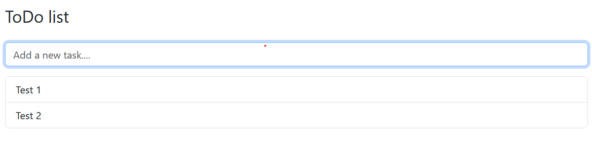
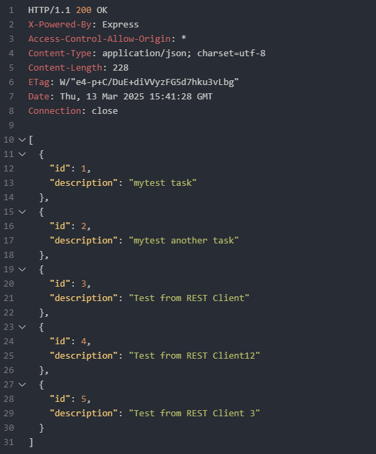
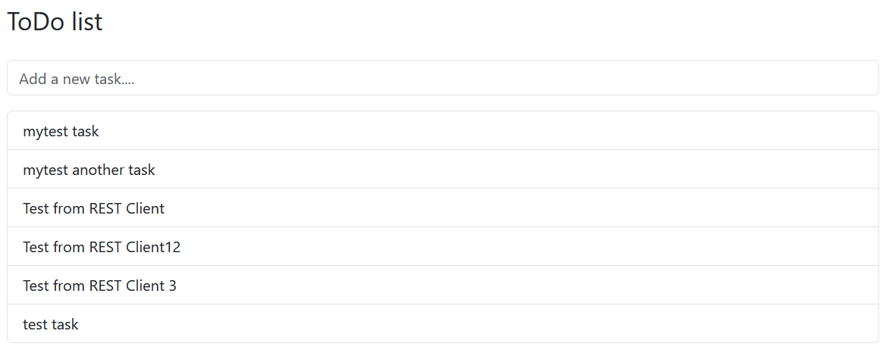

# To-Do: To-Do

✅✅❌❌❌❌❌❌


## A repository for my To-Do project

### To-Do part 1

- Add basic functionality
- Code split into files:
  - `todo_project\index.html` — web page of the project
  - `todo_project\CSS\style.css` — css stylesheet
  - `todo_project\js\index.js` — javaScript file to handle the front end
- Add [Bootstrap](https://getbootstrap.com/) to the page. Insert this into `<head>` section of the **index.html** file:

```HTML
		<link
			href="https://cdn.jsdelivr.net/npm/bootstrap@5.3.3/dist/css/bootstrap.min.css"
			rel="stylesheet"
			integrity="sha384-QWTKZyjpPEjISv5WaRU9OFeRpok6YctnYmDr5pNlyT2bRjXh0JMhjY6hW+ALEwIH"
			crossorigin="anonymous"
		/>
```

**Bootstrap** is a popular open-source front-end framework designed for building responsive and mobile-first websites quickly and efficiently. Developed by Twitter, it provides a collection of pre-designed HTML, CSS, and JavaScript components, including a grid system, buttons, forms, modals, and navigation bars, allowing developers to create consistent and visually appealing layouts with minimal effort. Bootstrap's responsive design adapts seamlessly to different screen sizes, making it ideal for modern web development. It also supports customization through its Sass variables and utility classes, enabling developers to tailor the design to their specific needs.



Page looks surprisingly nice with very low effort. One can add tasks by typing the text and pressing **Enter** key.

Refreshing the page clears all tasks since they are not stored anywhere.

## To-Do part 2

- Add `.\server` folder
- Install [PostgradeSQL](https://www.enterprisedb.com/downloads/postgres-postgresql-downloads)
- Create database **todo**
- Create table **task**
- Create `.\server\index.js` - backend script that handles requests

Username for postgres: **postgres**

Password for postgres: `********`

Had some problems with the example code. On one screenshot it was:

```sql
create table task (
    is int primary key auto_increment,
    description varchar(255) not null
)
```

But apparently postgres does not support `auto_increment`. One should use `serial` insetead. Correct query was provided on a later screenshot:

```postgres
create table task(
    id serial primary key,
    description varchar(255) not null
);
```

### Libraries used:

- **Cors** for enabling clients to connect to this service without any Cors restrictions.
- **Express** is used for creating HTTP endpoints (get, post, etc.).
- **Nodemon** is used to watch changes in code and restart the backend server
  automatically when changes occur.
- **PG** is used to access the Postgres database from the NodeJS app.
  To install libraries run following command inside `.\server` folder:

```
npm i express cors nodemon pg
```

To start a local server modify `server\package.json` file:

```json
"scripts": {
    "test": "echo \"Error: no test specified\" && exit 1",
		// to start the server navigate to \server folder and execute "npm run devStart" command from terminal
        "devStart": "nodemon -r dotenv/config index.js" //-r dotenv/config loads the .env file every time the server restarts
	},
```

For security reasons I also installed `dotenv`

````

npm install dotenv

```

Create a new file `.env`

Content of .env file:

```

DB_USER=postgres
DB_HOST=localhost
DB_NAME=todo
DB_PASSWORD=mypassword
DB_PORT=5432

````

Modified `\server\index.js` part:

```js
require("dotenv").config(); // Load environment variables

const openDb = () => {
	const pool = new Pool({
		user: process.env.DB_USER,
		host: process.env.DB_HOST,
		database: process.env.DB_NAME,
		password: process.env.DB_PASSWORD,
		port: process.env.DB_PORT,
	});
	return pool;
};
```



Hint: in `client.rest` file there is no need to type "Send request". It results in error.
Some of the example code contained typeScript syntax. Was easy quite easy to fix.

Add `.gitignore` file

## To-Do part 3


The frontend script can fetch data from the backend by making HTTP call.
The frontend script can push data to the backend by using post HTTP method.

## To-Do part 4

Add bootstrap JavaScript (idk why yet)

```html
<script src="https://cdn.jsdelivr.net/npm/bootstrap@5.3.2/dist/js/bootstrap.bundle.min.js"></script>
```

Create new files:

- `.\js\class\Task.js`
- `.\js\class\Todos.js`

Change link to `\js\index.js` to support export/import

```html
<script src="./js/index.js" type="module"></script>
```
